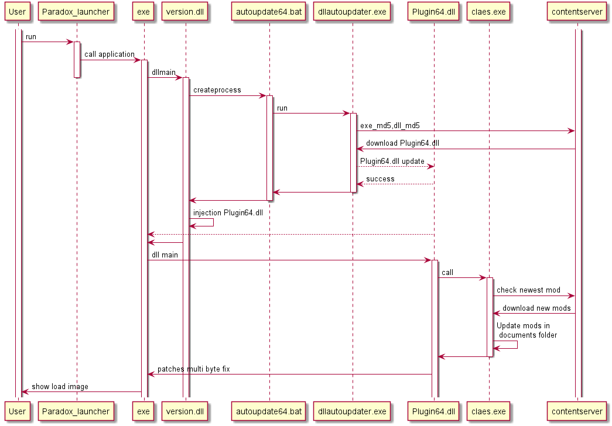

# Dll Distribution server
 
 # sequence
 
 
 
# component
 
 
## infra
  - AWS: https://aws.amazon.com/jp/
    - CloudFront
    - EC2
    - RDS
    - Route53
    - S3
  - GitHub: https://github.com/
    - this repository
    - private repository
  - DockerHub: https://hub.docker.com/
    - gnagaoka/triela-app:latest (public)
    - gnagaoka/triela-private:latest (private)
  - circleci: https://circleci.com/
  - DotTK: http://www.dot.tk/en/index.html?lang=en
  - ZeroSSL: https://zerossl.com/
  - Discord: https://discordapp.com/

## component 
  - Java 11 later: https://openjdk.java.net/projects/jdk/11/
  - MySQL 8 later: https://www.mysql.com/jp/
  - cURL: https://curl.haxx.se/
  - Docker: https://www.docker.com/
  
## app
  - lombok: https://projectlombok.org/
  - gradle: https://gradle.org/
  - Spring boot 2 later: http://spring.io/projects/spring-boot
  - Spring security oauth2 autoconfig: https://docs.spring.io/spring-security-oauth2-boot/docs/current/reference/htmlsingle/
  - OkHttp3: http://square.github.io/okhttp/
  - retrofit: https://square.github.io/retrofit/
  - MyBatis + annotation: http://blog.mybatis.org/
  - thymeleaf: https://www.thymeleaf.org/index.html
  - caffeine: https://github.com/ben-manes/caffeine
  - swagger: https://swagger.io
  - logback
  - Slf4j

## IDE and doc
  - IntelliJ IDEA: https://www.jetbrains.com/idea/
  - swagger: https://swagger.io
  - markdown
  - PlantUML: http://plantuml.com/

## VM setup

Prepare instance. Reboot instance from EC2 Console.

```
$ sudo yum update -y
$ sudo amazon-linux-extras install docker -y
$ sudo systemctl start docker 
$ sudo usermod -a -G docker ec2-user
$ sudo systemctl enable docker
```

Install docker-compose.

```
$ sudo -i
$ curl -L "https://github.com/docker/compose/releases/download/1.23.2/docker-compose-$(uname -s)-$(uname -m)" -o /usr/local/bin/docker-compose
$ chmod +x /usr/local/bin/docker-compose
$ exit
```

download docker-compose.yml

```
$ wget https://gist.githubusercontent.com/matanki-saito/2aff62cbdd20b921ccc8dffcf5f33ae0/raw/992323cdfc3f8a58a8847f9d0f122aea8fb4a419/docker-compose.yml
```
```
$ docker-compose down && docker-compose up -d
```
